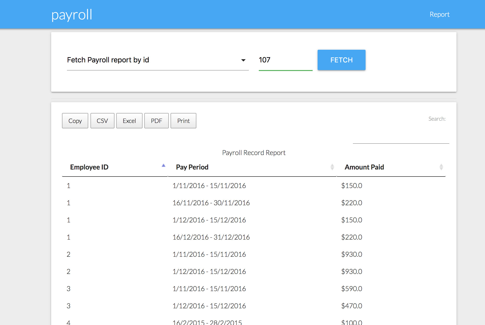

# payroll

Pay me what you owe me ;)

## Getting started

This project was developed using Python(Django)/Js/HTML/CSS and makes use of a CDN for development.

## Docker

To develop and/or run this application, download and install [docker](https://www.docker.com/get-started) and [docker-compose](https://docs.docker.com/compose/install/) from their website before proceeding.

Run the command `docker-compose up` from the **root directory** i.e. where you have the `docker-compose.yml` file and you should be good to go.

`docker-compose down` or `CMD/ctrl + C` to stop the application.

`docker-compose build` to build the application and `docker-compose up --build`  to build and run the application in one commnand. :)

## Services

The application consists of three(3) major services: Web, Database and Memcached. These services are coupled together using the `docker-compose.yml` file at the root of the application.

The Project specifications:

- User can fetch a `Pay` report (the Uploaded report) by id or a `Payroll` report (the Generated report) by id when you are on the `/pay/report/` route. This page is **scrollable** as this page can hold these reports when fetched.
- User can download reports generated or uploaded as `CSV, EXCEL AND PDF`
- User can `Copy` the generated reports to Clipboard and can `Print` the generated report too.
- Generated `payroll` results and uploaded `pay` reports are saved to the database. `Memcached` was introduced to save the database from making multiple queries whenever a report is repeatedly called. This takes care of the overhead of repeated queries to the database.
- Django comes with an `Admin` dashboard by default, to view the admin dashboard after starting up the application, navigate to the `/admin` route and login using the details below

```text
Username: devadmin
password: nimda
```

You can find this written here `payroll/scripts/start_server.sh`

### RUNNING THE APP

Once you have the application running locally using `docker-compose up` from the **root directory** navigate to the homepage `localhost:8000` or `0.0.0.0:8000` to take the app for a spin. `:)`

The app has an extra navigation link at the top right called `Report`, this will take you to the report page where you can fetch report(s) by id.


